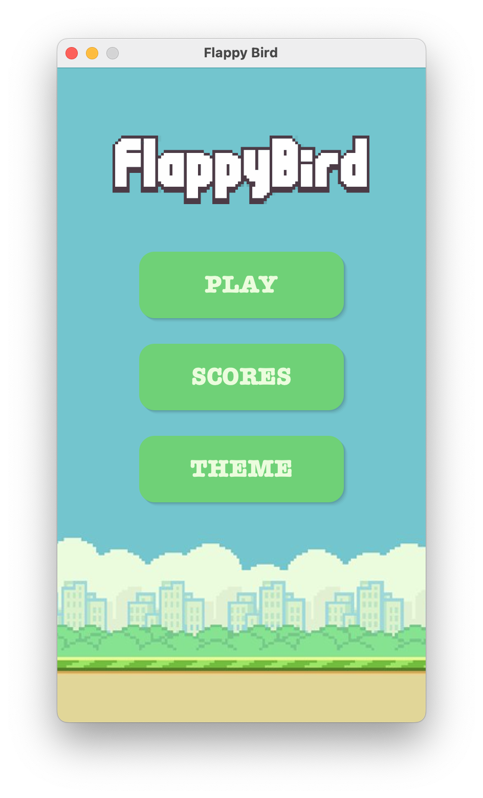
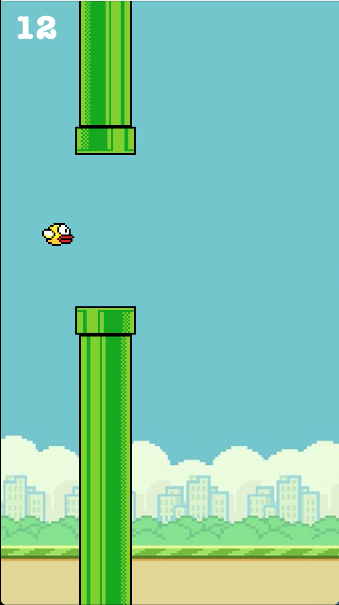

# Flappy Bird 🐤

A simple implementation of the classic Flappy Bird game in Java using Swing.

--- 

## ✨ Features

- Classic Flappy Bird gameplay
- Game over and restart functionality
- Score tracking
- Sound effects 
---
## 🎮 How to Play

* Press `SPACE` to make the bird jump
* Avoid the pipes
* Try to get the highest score!
* Press `SPACE` after game over to restart
---
## 🧩 How to Run

1. Clone the repository:
```bash
git clone https://github.com/celiahmm/flappy-bird.git
cd flappy-bird/src
```

2. Run the game:
```bash
javac Game.java
java Game
```

---
## 🚀 Future Improvements

- [ ] Add high score tracking
- [ ] Improve UI/UX
- [ ] Game reskin options

---

## 🖼️ Screenshots

<p align="left">
    
    
    
</p>

---
## 🔧 Technologies

- **Language:** Java
- **GUI Library:** Swing
- **IDE:** IntelliJ IDEA

---
## 🎓 About the Project

Just a little learning project :)  
Feel free to play and improve it! ✨
# Bird_Game_Flappy
# Bird_Game_Flappy
